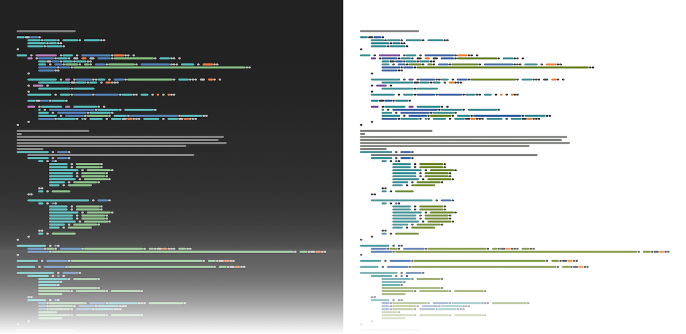
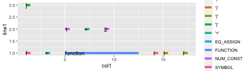

## Code minimaps in R

[Code minimaps][] are a feature of some modern code editors in which the code is
displayed with a drastically reduced font size, so that all that can be
discerned are patterns based on indentation, line length and syntax colouring.

Ostensibly code minimaps help navigating large files. Well, *maybe*. But when
done right they become interesting design elements.

So how do we do it right? First of, rather than actually printing text I wanted
to have plain lines (printing text makes the image much more visually busy, and
looks messy). To plot lines from source code, we therefore need to obtain a
tokenised representation of the source code with syntax information (for the
colours) and somehow generate *x*/*y* coordinates for each token.

Luckily, R makes this *much easier* than is reasonable: when parsing source code
(via `parse`), we can retain the internal parse data, and retrieve it in tabular
form via `getParseData`:


```r
expr = parse(text = '1 + 2', keep.source = TRUE)
getParseData(expr)
```


| &nbsp; | line1 | col1 | line2 | col2 | id | parent | token     | terminal | text |
|:------:|------:|-----:|------:|-----:|---:|-------:|:----------|:---------|:-----|
| **7**  |     1 |    1 |     1 |    5 |  7 |      0 | expr      | FALSE    |      |
| **1**  |     1 |    1 |     1 |    1 |  1 |      2 | NUM_CONST | TRUE     | 1    |
| **2**  |     1 |    1 |     1 |    1 |  2 |      7 | expr      | FALSE    |      |
| **3**  |     1 |    3 |     1 |    3 |  3 |      7 | '+'       | TRUE     | +    |
| **4**  |     1 |    5 |     1 |    5 |  4 |      5 | NUM_CONST | TRUE     | 2    |
| **5**  |     1 |    5 |     1 |    5 |  5 |      7 | expr      | FALSE    |      |

This generates a lot of data that isn’t interesting for us: we only care about
those pieces that are “terminals”:


```r
box::use(dplyr[`%>%`, filter])

getParseData(expr) %>% filter(terminal)
```


| line1 | col1 | line2 | col2 | id | parent | token     | terminal | text |
|------:|-----:|------:|-----:|---:|-------:|:----------|:---------|:-----|
|     1 |    1 |     1 |    1 |  1 |      2 | NUM_CONST | TRUE     | 1    |
|     1 |    3 |     1 |    3 |  3 |      7 | '+'       | TRUE     | +    |
|     1 |    5 |     1 |    5 |  4 |      5 | NUM_CONST | TRUE     | 2    |

And this is almost *exactly* what we need to pass it directly to ‘ggplot2’ (with
the source code added as labels to clearly show what is being plotted):


```r
box::use(ggplot2[...])

expr = parse(text = 'f = function () {\n    1 + 2\n}', keep.source = TRUE)

getParseData(expr) %>%
    filter(terminal) %>%
    ggplot() +
    aes(x = col1, y = line1, xend = col2 + 0.5, yend = line1, color = token) +
    geom_segment(size = 2) +
    geom_text(aes(label = text), hjust = 0, size = 4, color = 'black')
```



Hmm. OK, a few things:

1. The whole thing is on its head. To fix this, we need to specify
   `scale_y_continuous(trans = 'reverse')`.
2. We probably want to remove the grid, axes and background. This means:
   `theme_void()`.
3. Oh, and also the legend.
4. Rounded segments look better.


```r
getParseData(expr) %>%
    filter(terminal) %>%
    ggplot() +
    aes(x = col1, y = line1, xend = col2 + 0.5, yend = line1, color = token) +
    geom_segment(size = 2, lineend = 'round') +
    scale_y_continuous(trans = 'reverse') +
    scale_color_discrete(guide = FALSE) +
    theme_void()
```


Much better, but there’s still room for improvement:

1. There are too many different token types (and, consequently, too many
   colours). To fix this, we need to replace, for instance, all the different
   punctuation tokens (`'('`, `')'`, `'+'`, `EQ_ASSIGN` etc.) with a single
   token type.
2. The colours aren’t exactly pretty. Luckily, the internet is full of syntax
   highlighting colour schemes for us to choose from.
4. The spacing is off. This will require adding margins, and calculating
   suitable plot dimensions to fit the source code appropriately.
5. In the above I’ve added an offset of `0.5` to `col2` so that tokens
   consisting of a single character are visible. But tokens adjacent to spaces
   look better if both their start and end are offset instead.

All this is implemented in the module `minimap.r`. This module generated the
images at the beginning of the article.

The module requires ‘[box][]’. It can be run either as a stand-alone command
from the command line:

```bash
./minimap [-c colorscheme] input-file.r
```

… or it can be imported and used from other R code:


```r
box::use(klmr/minimap)

filename = 'input-file.r'
p = minimap$plot_code_minimap(filename, minimap$colorschemes$tomorrow)
plot(p)
# To save the plot, calculate its ideal dimensions first:
dim = minimap$minimap_dim(filename)
```

[Code minimaps]: https://en.wikipedia.org/wiki/Mini-map#Code_Minimap_in_Text_editors_and_IDEs
[box]: https://klmr.me/box/
